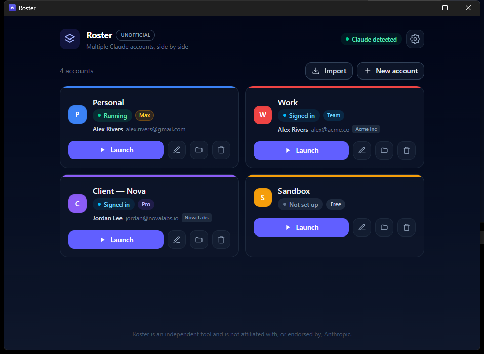

# Roster

**Run multiple Claude and ChatGPT desktop accounts side by side on Windows.**

Neither Claude Desktop nor the ChatGPT desktop app has an account switcher — if you use a personal and a work account, you're stuck signing in and out. Roster runs each account in its own isolated window so you can use them all at the same time.



<sub>Demo data pictured — no real accounts shown.</sub>

> ⚠️ **Unofficial.** Roster is an independent tool and is **not affiliated with, endorsed by, or supported by Anthropic or OpenAI.** "Claude" is a trademark of Anthropic; "ChatGPT" is a trademark of OpenAI.

## Features

- 🪟 **Side by side** — run any number of Claude and ChatGPT accounts at once, each in its own window
- 🧩 **Both apps, one roster** — accounts are grouped per app, with the plan tiers each one actually offers
- 🎨 **Color-coded** — every account gets an accent color so you never mix them up
- 👤 **Know who's who** — see the signed-in account's name, email, and (manually tagged) plan on each card
- ⚡ **Import existing logins** — adopt the accounts you're already signed into, no re-login
- 🚀 **One-click launch** — open one profile, or all of them

## Install

1. Download the latest `Roster_x.y.z_x64-setup.exe` from the [Releases](../../releases) page.
2. Run it. Because it isn't code-signed yet, Windows SmartScreen may say *"Windows protected your PC"* — click **More info → Run anyway**.

Requires at least one of [Claude Desktop](https://claude.ai/download) or the [ChatGPT desktop app](https://openai.com/chatgpt/download/). Roster detects whichever you have and only offers those.

## How it works

Both apps are Electron apps shipped as MSIX packages, which makes the same trick work for each of them.

Electron accepts a `--user-data-dir` flag that points an instance at its own data folder — a separate login, history, and settings. Roster manages a set of these per-account folders and launches an isolated instance for each, so logins live in their own directories and are never shared between accounts.

Because they're MSIX packages, their executables sit in a version-stamped `WindowsApps` folder that Windows refuses to launch directly and that moves on every update. Roster therefore starts them by **AppUserModelID** via `IApplicationActivationManager` — an id that stays constant across updates — and passes `--user-data-dir` along with it. That's what keeps launching working when Claude or ChatGPT updates itself underneath you.

| | Claude | ChatGPT |
| --- | --- | --- |
| Package | `Claude_pzs8sxrjxfjjc` | `OpenAI.Codex_2p2nqsd0c76g0` |
| Activation id | `Claude_pzs8sxrjxfjjc!Claude` | `OpenAI.Codex_2p2nqsd0c76g0!App` |
| Profile layout | Electron (data at the folder root) | Chromium (data under `Default\`) |

## Build from source

Prerequisites: [Node.js](https://nodejs.org) and the [Rust toolchain](https://rustup.rs), plus the MSVC build tools + WebView2 (see the [Tauri prerequisites](https://tauri.app/start/prerequisites/)).

```bash
npm install
npm run tauri dev      # run in development
npm run tauri build    # produce an installer
```

Built with [Tauri](https://tauri.app) (Rust) · React · TypeScript.

## License

[MIT](LICENSE)
